<h1></h1>

Generate SDKs and API tools from one OpenAPI contract. Keep the source,
customizations, checks, and releases under your control.

Kaji generates TypeScript, Rust, Go, Python, PHP, Java, C#/.NET, Elixir, Ruby,
and Swift SDKs, plus API CLIs, Postman collections, Terraform providers,
frontend helpers, mocks, documentation, and MCP tools. Its typed Rust plugin
system lets you compose or extend generation for your own needs.

Read the [full feature catalog](docs/features.md) for capabilities, language differences, configuration entry points and verification limits.

## Why Kaji?

Kaji is the best fit when you want to own and extend the whole SDK workflow.
Compose typed plugins, bundle your HTTP policies, modify the generator sources,
and ship native SDKs and API artifacts with editable checks and release workflows.

Read [why choose Kaji and how it compares](docs/comparison.md) to SDK platforms,
plugin generators and language-specific tools, with official sources and clear
tradeoffs.

## What do you want to do?

| Your goal | Start here | Kaji helps you |
| --- | --- | --- |
| Move from Stainless, Fern or Speakeasy | [Migration guide](docs/migration.md) | Reuse your project configuration and supported OpenAPI annotations. |
| Generate my first SDK | [Quickstart](docs/cli/quickstart.md) | Turn an OpenAPI file into a package you can build and use. |
| Ship SDKs to my customers | [SDK author guides](docs/README.md) | Generate, customize, check, and release packages. |
| Bundle idempotency keys and safe mutation retries | [Idempotency guide](docs/guides/idempotency.md) | Configure supported endpoints through OpenAPI or `kaji.json`. |
| Add my own HTTP behavior | [Bundled middleware example](examples/bundled-middleware/README.md) | Ship policies that run without customer setup. |
| Modify generated code safely | [Customization](docs/sdk-customization.md) | Apply package overrides and preserve custom files across regeneration. |
| Automate GitHub delivery | [Repository automation](docs/sdk-automation.md) | Open SDK PRs and give each language repository its own workflows. |
| Publish an SDK release | [Publishing](docs/sdk-publishing.md) | Check released tags and configure supported trusted publishers. |
| Generate Postman or Terraform artifacts | [Artifact example](examples/api-artifacts/README.md) | Export collections or build typed providers from supported CRUD resources. |
| Build frontend hooks or validation | [TypeScript helpers](docs/guides/typescript-helpers.md) | Add query helpers, Zod schemas, fixtures, and mocks. |
| Build a plugin or embed Kaji | [Rust library guides](docs/library/README.md) | Compose typed providers and add custom generation. |
| Give an AI access to my API or generator | [MCP guide](docs/mcp-server.md) | Expose API operations or local generation tools. |
| Ask a question or report a problem | [Get help](#get-help) | Share your goal or a reproducible issue. |

**Trying 0.5.0?** This branch contains the new features. Until the release is
published, follow the [source build guide](docs/source-customization.md).
See the [changelog](CHANGELOG.md#050--2026-10-08) for scope and limitations.

<details>
<summary>Explore what Kaji generates</summary>

```text
OpenAPI
  │
  ▼
Kaji
  ├── SDKs          TypeScript · Go · Python · Rust · Java · C#/.NET · PHP · Elixir · Ruby · Swift
  ├── Artifacts     Postman Collection 2.1 · Terraform Plugin Framework providers
  ├── Delivery      GitHub checks · SDK sync PRs · Release Please · Trusted publishing
  ├── Integrations  Symfony (wraps the generated PHP SDK)
  ├── API CLIs      TypeScript (Node.js) · Rust (native)
  ├── Clients       Fetch · Axios
  ├── Frontend      TanStack React Query · Vue Query · SWR
  ├── Schema        Zod · Faker
  ├── Testing       MSW · Cypress · HTTP mocks
  ├── Docs          ReDoc
  └── AI            MCP
```

</details>

Read [why we built Kaji](docs/why-kaji.md) for the project’s goals and its
commitment to stay free.

## Quick start

Kaji is pre-1.0. Install or run it through the published npm facade; it downloads
the platform-native generator and bundled OpenAPI compiler automatically:

```sh
npx @relevate/kaji init --input ./openapi.yaml --output ./generated --name "Email" --sdk-version 1.0.0
# edit kaji.json, then:
npx @relevate/kaji generate
```

`npx @relevate/kaji init` creates a JSON recipe with its OpenAPI source, output root, SDK
packages and plugins. Add as many independently configured packages as you
need, then run `npx @relevate/kaji generate` again whenever the contract changes.

`@relevate/kaji` is a small Node launcher for bundled native executables;
installed npm users do not need Rust or Go.
The generator itself is Rust, with a bundled Go OpenAPI compiler.

## For SDK authors

Start with [the SDK-author documentation](docs/README.md). The complete workflow
is to generate a package, ship your own policies, test the generated code, then
review SDK and release pull requests before publication.

| Next step | Guide |
| --- | --- |
| Generate and understand your first SDK | [CLI quickstart](docs/cli/quickstart.md) |
| Bundle middleware that customers do not have to register | [Executable author example](examples/bundled-middleware/README.md) |
| Customize one language package | [SDK customization](docs/sdk-customization.md) |
| Preserve custom work when the contract changes | [Safe regeneration](docs/safe-regeneration.md) |
| Generate CI, sync, and release workflows | [SDK repository automation](docs/sdk-automation.md) |
| Export Postman collections and typed Terraform providers | [API artifacts example](examples/api-artifacts/README.md) |
| Publish checked release tags | [SDK publishing](docs/sdk-publishing.md) |

The 0.5.0 features are available on this branch. Until 0.5.0 is published, use
the [source build](docs/source-customization.md) to try them. Workflow scaffolding does not provision a GitHub App or
registry account; the delivery guides explain that setup and its verification.

Python users can install the same native CLI through pip:

```sh
python -m pip install kaji-cli
kaji init --input ./openapi.yaml --output ./generated
kaji generate
```

`kaji-cli` includes the executable for its platform; Python is only the console
entry point. Wheels currently support macOS ARM64/x64, Linux x64 with glibc 2.35+
and Windows x64.

## Common commands

```sh
# See available SDK targets
npx @relevate/kaji languages

# Start or use an explicit JSON recipe
npx @relevate/kaji init --input openapi.yaml
npx @relevate/kaji generate --config ./kaji.json

# Generate every SDK language (TypeScript uses Fetch by default)
npx @relevate/kaji generate openapi.yaml --output ./generated --language all

# Generate TypeScript operation functions without an SDK class
npx @relevate/kaji generate openapi.yaml --output ./generated \
  --language typescript --typescript-surface raw

# Generate a flat client instead of resource namespaces
npx @relevate/kaji generate openapi.yaml --output ./generated \
  --language go --client-style flat
```

The JSON recipe is the recommended route. Direct command-line generation stays
useful for one-off output and CI experiments. All options and every built-in
config plugin are documented in the [CLI guide](docs/cli.md).

Both modes accept a local OpenAPI file or an HTTPS URL. For example:

```sh
npx @relevate/kaji generate https://aka.ms/graph/v1.0/openapi.yaml \
  --output ./graph-sdk --language go --name "Microsoft Graph"
```

## What you get

A generated TypeScript client can look like this:

```ts
const client = new Email({
  baseUrl: "https://api.example.com",
  apiKey,
});

const contact = await client.contacts.get({
  path: { contactId: "contact_123" },
});
```

Names and parameters come from your API. Each generated package includes
its own usage guide and build metadata. TypeScript operations resolve to the
decoded success body by default.

A generated CLI follows the same contract, but turns operations into commands:

```sh
email messages send --from hello@example.com --to customer@example.com \
  --subject "Welcome"
email admin users list
```

Its `auth` group supports OAuth login, OpenAPI API keys, named credential
profiles, and environment variables for CI. See the [TypeScript API CLI](docs/typescript-cli.md)
and [Rust API CLI](docs/rust-cli.md) guides.

## Choose what you ship

- **Full SDKs:** configured clients, typed requests/responses, resource namespaces,
  declared errors, and contract-driven runtime features.
- **Direct operations:** select a flat client, or TypeScript raw functions with
  `--typescript-surface raw`.
- **API CLIs:** generate a publishable Node.js or native Rust executable from
  the same paths, parameters, request bodies, and security requirements.
- **Fetch or Axios:** separate TypeScript packages with the same source contract.
- **OpenAPI 3.2:** whole-query inputs, sequential JSON, ordered/nested multipart,
  and typed metadata for plugins. See [the 3.2 guide](docs/guides/openapi32.md).
- **Evolving APIs:** open enum policies, unknown-field preservation and explicit
  null presence. See [model compatibility](docs/guides/forward-compatible-models.md).
- **Large Go APIs:** split model/operation files and bounded rendering workers.
  A [pinned 205-contract corpus](docs/large-specs.md#apisguru-corpus) covers
  200 OpenAPI providers plus five Azure services, with native-check workflows
  for every SDK language.
- **Validation and frontend helpers:** add Zod, TanStack React/Vue Query, SWR,
  Faker, MSW, and Cypress beside a TypeScript package through `kaji.json`.
- **Documentation artifacts:** add ReDoc or an MCP tool manifest through the
  same recipe.
- **Contract mocks:** add an optional `httpmock` Docker package usable by every
  generated SDK.
- **Postman collections:** generate requests, examples, auth variants, and blank
  environment templates from the contract.
- **Terraform providers:** generate typed Go Plugin Framework resources from
  validated CRUD bindings. The initial implementation supports flat scalar resources.
- **Custom generators:** language-scoped Rust plugins and typed dependencies,
  without a JavaScript generation runtime.

Supported auth, pagination, retries, streaming and file handling depend on the
contract and target. Read the [generated SDK guide](docs/generated-sdks.md)
before choosing a runtime integration; this is not a promise of identical
features or API spelling in every language.

SDK customers can customize transport behavior with middleware. SDK authors can
add, replace, or patch source in one language package through their recipe;
regeneration reapplies the override. See [SDK customization](docs/sdk-customization.md)
for language-specific middleware and package-scoped source examples.

## Rust interface

For embedding Kaji or writing custom plugins, a typed Rust interface is also
available. See the [Rust API guide](docs/getting-started.md) and
[plugin authoring reference](docs/typed-plugins.md).

## New in 0.5.0

- Bundle HTTP middleware into an SDK so your policies run by default. Add,
  replace, or patch source for one package while retaining typed plugin support.
- Regenerate safely with ownership tracking, customer edit protection,
  create-once files, stale-file cleanup, and drift checks.
- Generate Postman Collection 2.1 exports and typed Terraform providers, with
  editable validation actions and runnable examples.
- Deliver SDKs through review PRs, preserve independent package versions, and
  release checked tags through Release Please and supported registry OIDC flows.
- Use one SDK repository per language, with destination-scoped generation jobs
  and each repository's own editable build, test, release, and publishing actions.
- Generate optional API references and Python/Go operation tests. Exercise SDK
  wire behavior in a shared ten-language CI suite with explicit coverage limits.
- Use native page-number pagination in every SDK target, retaining streams,
  generators and async iteration. [Pagination capabilities](docs/guides/pagination.md)
  list the supported forms and bindings.
- Enable structural response checks in TypeScript, Go, Python and Ruby; generate
  Terraform data sources and run Postman collections against local test APIs.
- Extend SDK runtimes and models with Python async/OAuth/webhook support,
  TypeScript wide integer handling, Java open enums, and provider composition.

See the [0.5.0 changelog](CHANGELOG.md#050--2026-10-08) for the complete changes
and current limitations.

## Generate, review, and publish

After generating packages with delivery metadata, scaffold your GitHub workflows:

```sh
# One repository per language; also supports a shared SDK repository
kaji sdk init --root generated --config kaji.json \
  --repository-pattern 'acme/api-{lang}' --auth app --dry-run
```

Remove `--dry-run` to write the source workflow and stage each destination's
editable action files under `.kaji/sdk-repository-setup/OWNER/REPO/`.
Install a selected setup through a reviewable PR:

```sh
kaji sdk install \
  --setup .kaji/sdk-repository-setup/acme/api-typescript \
  --repository acme/api-typescript --dry-run
```

Remove `--dry-run` when ready to open the setup PR. Create the destination
repositories first, grant the GitHub App access, and configure registry trust
and release environments per repository. Setup installation requires credentials
with permission to write workflow files. Routine generation uses scoped tokens.
See [repository automation](docs/sdk-automation.md), [editable GitHub Actions](docs/github-actions.md),
and [publishing](docs/sdk-publishing.md) for the complete setup.

## Get help

Tell us what you want to generate, your target language, and where you are stuck.
[Open a GitHub issue](https://github.com/rlvtapp/kaji/issues/new) for questions,
bugs, or feature requests. For a bug, include your Kaji version, a minimal
`kaji.json`, a small OpenAPI example, the command you ran, and the actual versus
expected result. Remove credentials before sharing files.

### Ask AI about Kaji

[Open ChatGPT](https://chatgpt.com/) or use your preferred assistant with our
[AI context and prompts](docs/ai.md). Copy this prompt and replace the brackets:

```text
Help me use Kaji to [my goal] for [language]. I am using version [version].
Start with https://github.com/rlvtapp/kaji/blob/0.5.0/docs/ai.md and follow
its links to the relevant guides. Check the source for that version before
suggesting config fields or commands. Give me a minimal working recipe,
verification steps, and any documented limitations.
```

The link opens a new chat; copy the prompt into it. Assistants that cannot
browse will need you to paste the relevant docs or provide a local checkout.
For tools that can interact with Kaji directly, see [MCP](docs/mcp-server.md).

## More examples and references

Browse the [documentation home](docs/README.md) or [examples index](examples/README.md).
Start with [bundled middleware](examples/bundled-middleware/README.md),
[Postman and Terraform](examples/api-artifacts/README.md),
[React Query](examples/react-query-consumer/README.md), or
[embedded Rust](examples/rust-embedded/README.md).
The [recipe reference](docs/config-file.md) and [plugin reference](docs/typed-plugins.md)
cover the full configuration and extension interfaces.

## License

Licensed under the [MIT License](LICENSE).

### Commercial license

Need a commercial license for Kaji? We've got you covered.

**[Get a commercial license →](https://www.youtube.com/watch?v=dQw4w9WgXcQ)**
