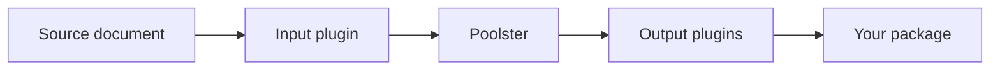

# About Poolster

Poolster turns API contracts into generated packages. Inputs read source formats;
outputs produce clients, models, hooks, test helpers or other artifacts.

Choose the input and outputs you need, add your own plugins, then regenerate when
the source changes. Poolster manages dependency order and file ownership.

## Where to start

- [JavaScript](../javascript/README.md) for Node projects.
- [Rust SDK](../rust/README.md) for embedded generation.
- [Support matrix](../plugin-support-matrix.md) for tested pipelines and limits.
- [Internals](../internals/README.md) for contracts, blocks and lifecycle rules.

OpenAPI is the established generation path. GraphQL client and companion additions
in this checkout are unreleased. Other protocols have their own support boundaries.

[Why Poolster](why-poolster.md) · [Roadmap](../reference/inputs/native-pipelines.md#remaining-work) ·
[Contributing](contributing.md)
