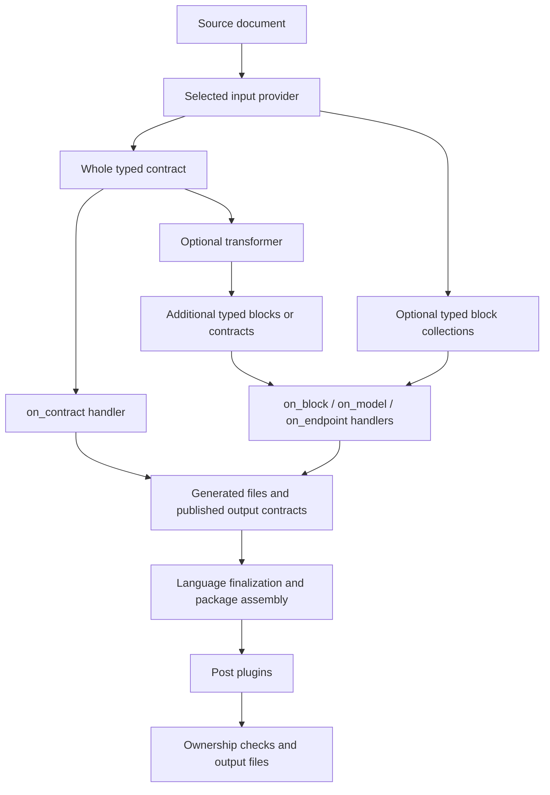

# Input contracts and block flow

Every first-party input package exposes `contracts` and `blocks` modules.
Whole contracts preserve protocol context. Blocks are optional typed projections,
not another parsing pass or generated source files. Public reexports preserve
shared core type identities; independently defined third-party types also work.

| Input | Whole contract | Published blocks |
| --- | --- | --- |
| OpenAPI | AdaptedApi / HttpContract | Schema models and HTTP operations |
| GraphQL | Native document; GraphqlOperations with supplied operations | Input models; selected operations when documents supplied |
| AsyncAPI | Native document; EventOperations when routing/broker supported | Useful message models independently of broker configuration |
| Protobuf | Native document and RpcContract | Service method blocks |
| Arazzo | Native document; WorkflowOperations with resolved source mappings | Resolved workflow step blocks |
| Cap'n Proto | Official descriptor request in CapnProtoDocument | Owned schema nodes, including capability interface methods |

Blocks do not flatten wire semantics into one universal shape. Protobuf message
wire definitions and Cap'n Proto layouts remain in their authoritative native
contracts. Unresolved Arazzo inspection does not publish executable steps.
Unsupported AsyncAPI message shapes receive diagnostics; supported message
blocks remain usable. GraphQL schema types are not selection result types.

Collections now include completeness and parent contract/revision metadata. Extractors bind to a specific whole-contract provider; paired consumers reject revision mismatches.

The typed dependency graph orders provider, transformer and consumer plugins.
The diagram's parallel branches describe independent consumers, not automatic
parallel execution. The whole contract and blocks can coexist; neither handler
requires the other. A custom opaque contract needs only `on_contract`.

A handler does not inherently generate code. It may inspect its input, emit
files, publish a new contract, or combine those actions. Output contract
publications must be declared and can feed downstream plugins. Native input
providers expose immutable typed values; changing a block snapshot does not
rewrite the whole contract. Transforms publish new authoritative data explicitly.

Existing built-in generators generally consume whole protocol contracts. New
block handlers are available for independently consuming models or operations;
public module exposure does not claim every built-in generator was rewritten.
The runtime API is Rust-native; Node equivalents remain follow-up work.
