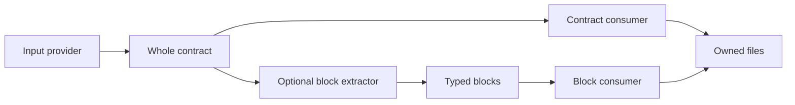

# Poolster internals

Understand one concept at a time.

| Concept | Read |
| --- | --- |
| What plugins exchange | [Contracts](contracts.md) |
| How a contract exposes smaller pieces | [Building blocks](blocks.md) |
| When each handler runs | [Lifecycles](lifecycle.md) |
| How generated files stay safe | [Ownership and files](files.md) |

A whole contract does not need blocks. A plugin can consume either or both.
Execution order follows declared dependencies, not the order of plugins in a list.

[All sections](../README.md) · [Detailed architecture](architecture.md)

[Language plugin implementation specification](../specifications/language-plugins.md)
