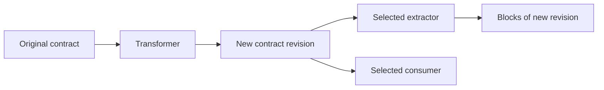

# Contracts

← [Internals](README.md)

A contract is the agreed data shape between a producer and a consumer.
It describes available information; an output plugin decides what to generate.

| Input | Authoritative contract |
| --- | --- |
| OpenAPI | HTTP API plus security definitions |
| GraphQL | Validated operations, variables and selected results |
| Protobuf | RPC services/methods and official wire descriptors |
| AsyncAPI | Messages, channels and broker bindings |
| Arazzo | Resolved workflow steps and control semantics |
| Cap’n Proto | Native schema/wire and capability information |

Some model semantics overlap. Transport, streaming and workflow behavior remain
protocol-specific. A model block alone does not imply an HTTP client or RPC client.

## Identity and selection

Rust contracts have a stable diagnostic name and a concrete Rust type. JavaScript
contracts use a shared exported token. These are different runtime interfaces.

A consumer selects a unique provider or names a provider explicitly. Multiple
compatible providers are ambiguous; Poolster does not pick whichever ran last.
A plugin may require several contract kinds and handle each differently.

## Transformations and revisions

Entity IDs stay stable; parent contract instance and revision are separate fields.
Consumers intentionally bound to the original still see the original. Derived
handlers reject blocks from another revision.

Custom contracts need neither blocks nor a codec. Optional versioned codecs are
available for serialization; they are not a general JavaScript/Rust bridge.

**Next:** [Building blocks](blocks.md) · [Authoring contracts](../plugins/rust/contracts.md)
