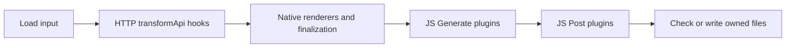

# Lifecycles

← [Internals](README.md)

Rust plugins and JavaScript plugins have different boundaries.

## Rust package lifecycle

Generate plugins consume and publish typed contracts. Whole-contract and block
handlers execute inside their plugin's selected phase. Post plugins can consume
earlier contracts and emit files, but language finalization does not run again.

Middleware and file-finalization hooks run when supported/configured. Source
customization edits generated source; schema overlays are a different concern.

## JavaScript lifecycle

For native GraphQL input, native package generation occurs during input handling;
HTTP transform hooks are unavailable. JavaScript plugins then receive the
inspection report and emitted files. They do not run inside Rust finalization.

Within each JavaScript plugin, `generate` runs before its HTTP `schema` and
`operation` visitors. Each callback may be async.

## Ordering rules

Providers run before declared consumers. Generate cannot depend on Post output.
Cycles, missing required publications and incompatible contract identities fail.
An unsupported bundled input/output combination can be skipped with a warning;
a malformed supported input still fails.

**Next:** [JavaScript hooks](../plugins/javascript/contracts.md) ·
[Rust handler API](../plugins/rust/handlers.md) · [Full hook reference](plugin-hooks.md)
